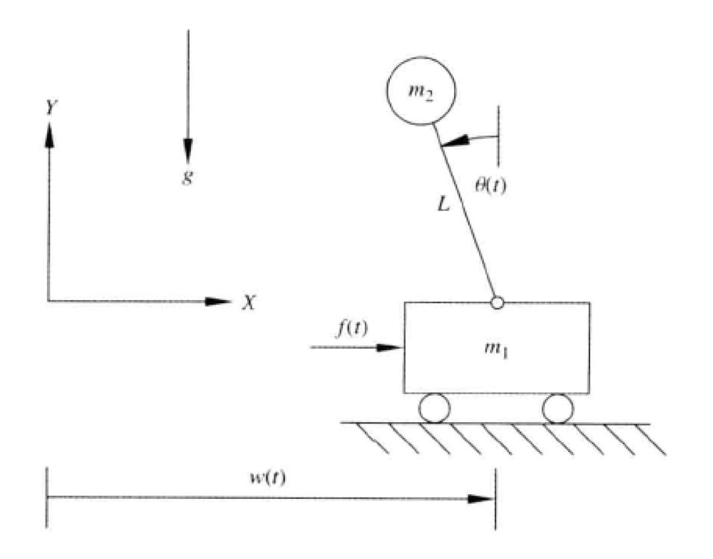
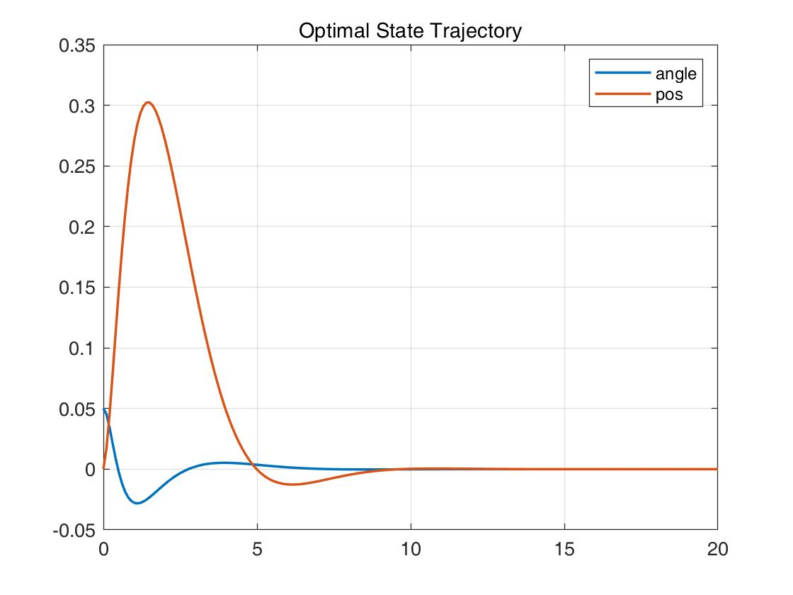

## 一阶倒立摆最优控制 Invert pendulum Optimal Control

考虑一阶倒立摆简化模型如下图，如图所示为非线性不稳定的倒立摆，目标是通过传感器测量𝜃(𝑡)构成反馈控制器来产生输入力𝑓(𝑡)，以保持倒立摆角度𝜃(𝑡) = 0。小车的质量为𝑚1，倒立摆质点质量为𝑚2，假设倒立摆杆没有质量，同时地面光滑。



### 推导过程

##### 系统状态方程求解 using Euler-Lagrange Equation 

该系统的Euler-Lagrange Equation ：
$$
L=T-V
$$
设车质量$M$，球质量$m$，杆长$L$，车x轴方向的位置为$P$


<u>车动能</u>：
$$
T_M=\frac{1}{2}M\dot{P}^2
$$
<u>球的动能</u>：

先表示出球的位置：
$$
x_m=P+Lsin(\theta),y_m=Lcos(\theta)
$$
则球的动能：
$$
\begin{array}
{}T_m&=\frac{1}{2}m({\dot{x}_m}^2+{\dot{y}_m}^2)\\

&=\frac{1}{2}m\dot{P}^2+\frac{1}{2}mL^2\dot{\theta}^2+m\dot{P}Lcos(\theta)\dot{\theta}
\end{array}
$$

<u>球的势能</u>：
$$
V=mgLcos(\theta)
$$
则：
$$
L=T-V=\frac{1}{2}(m+M)\dot{P}^2+\frac{1}{2}mL^2\dot{\theta}^2+m\dot{P}Lcos(\theta)\dot{\theta}-mgLcos(\theta)
$$
写出欧拉方程：
$$
\left\{\begin{array}{l}{\frac{d}{d t} \cdot\left(\frac{\partial L}{\partial \dot{p}}\right)-\frac{\partial L}{\partial p}=F} \\ {\frac{d}{d t} \cdot\left(\frac{\partial L}{\partial \theta}\right)-\frac{\partial L}{\partial \theta}=0}\end{array}\right.
$$
代入化简得：
$$
\left\{\begin{array}{l}

(m+M)\ddot{P}+(mL)\ddot{\theta}=F\\
(mLcos(\theta))\ddot{P}+(mL^2)\ddot{\theta}=mgLsin(\theta)

\end{array}\right.
$$
线性化近似得：
$$
\left\{\begin{array}{l}

(m+M)\ddot{P}+(mL)\ddot{\theta}=F\\
\ddot{P}+L^2\ddot{\theta}=gL\theta

\end{array}\right.
$$
解上述方程：
$$
\left\{\begin{array}{l}

\ddot{P}=(F-mg{\theta})/M\\
\ddot{\theta}=((M+m)g{\theta}-F)/(ML)

\end{array}\right.
$$

设状态变量$x=[P,\dot{P},\theta,\dot{\theta}]$，由上述关系可得：
$$
\dot{x}=\left[\begin{array}{cccc}{0} & {1} & {0} & {0} \\ {0} & {0} & {-m g / M} & {0} \\ {0} & {0} & {0} & {1} \\ {0} & {0} & {\frac{(M+m) g}{ML}} & {0}\end{array}\right]+\left[\begin{array}{c}{0} \\ {1 / M} \\ {0} \\ {-1 / (M L)}\end{array}\right]
$$


##### 设计状态反馈

此为LQR问题，Cost Function为：
$$
J=\int_{0}^{\infty}\left(x^{T} Q x+u^{T} R u\right) d t
$$
其最优控制为：
$$
u=-Kx
$$
其中，$K=R^{-1}B^TP$.

此问题是无限时长情况，$P$为代数$Riccati$方程的解：
$$
A^{T} P+P A-P B R^{-1} B^{T} P+Q=0
$$


利用MATLAB中的`dlqr`函数将此系统作为离散系统求解，代码如下：

```matlab
%% State-Space Model
A1 = [0,1,0,0;
    0,0,-m*g/M,0;
    0,0,0,1;
    0,0,(M+m)*g/M*L,0];

B1 = [0;1/M;0;-1/M*L];

C = [0 0 1 0;
    1,0,0,0];

%% Cost-Fnc wight matrix init
Q = [100,0,0,0;
    0,0,0,0;
    0,0,10,0;
    0,0,0,0];
R = 1;

%% Generate sys
S1 = ss(A1,B1,C,0); % define the sys
Ts = 0.1; % sample time

Sd = c2d(S1,Ts); % transfer to disperse sys
[Ad,Bd,Cd,Dd,TS] = ssdata(Sd); % get disperse-sys state-space matrix

%% LQR
[K,S,e] = dlqr(Ad,Bd,Q,R);

%% Generate new sys with state-feedback
tS = ss(Ad-Bd*K,Bd,Cd,Dd,Ts); % get new sys with state-feedback

%% Given initial state & Plot the result
x0 = [0,0.1,0.05,0]'; % init state: P'=0.1;theta=0.05
t=[0:0.1:20]; % timespan
[Y,X] = initial(tS,x0,t); % calculates the response of sys
```


##### Output

最优状态轨线：



最优控制：


由上图可知，求得了使$P=0,\theta=0$的最优控制.