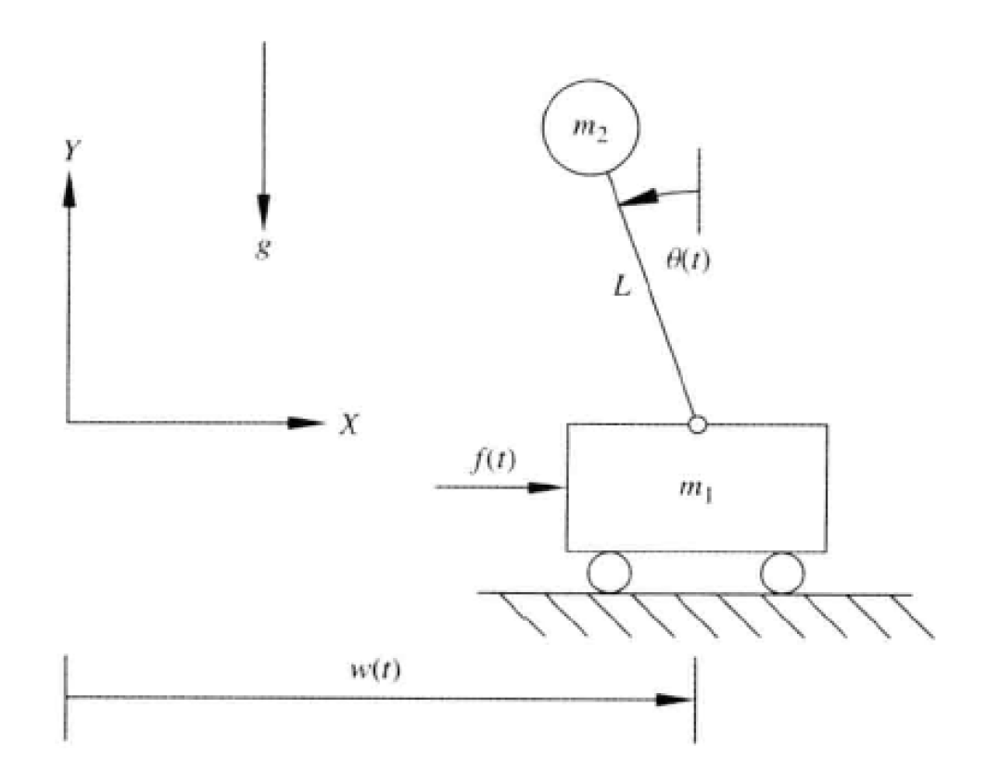
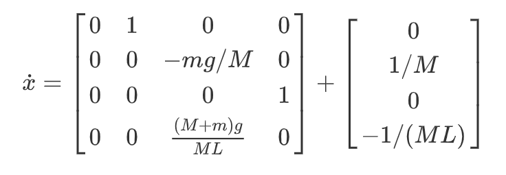
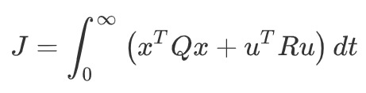
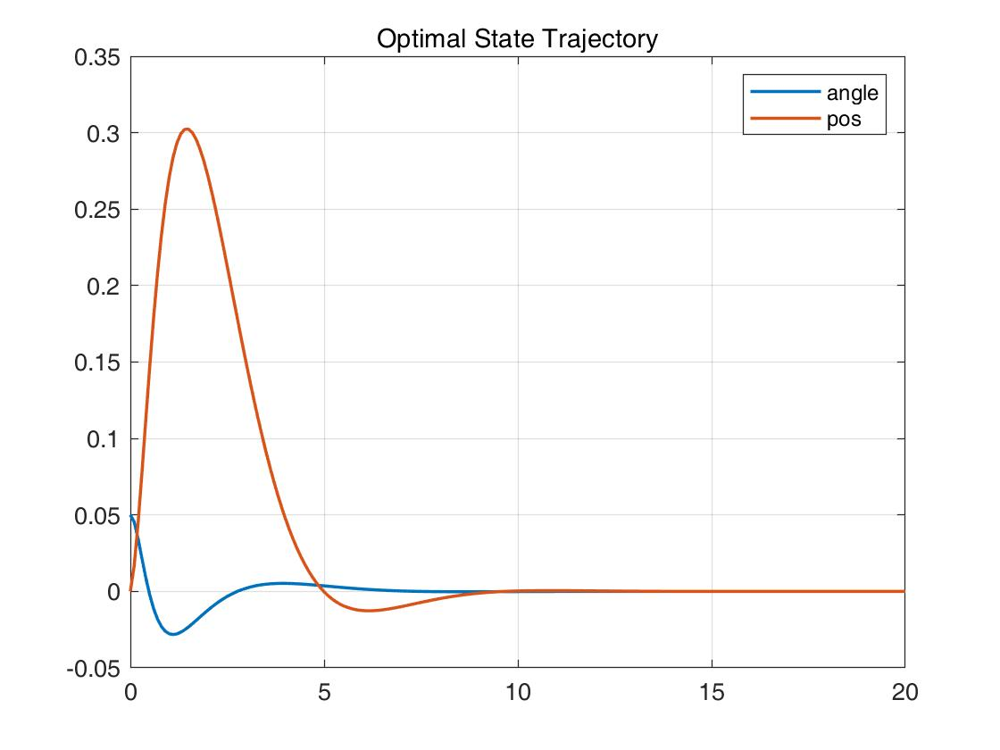
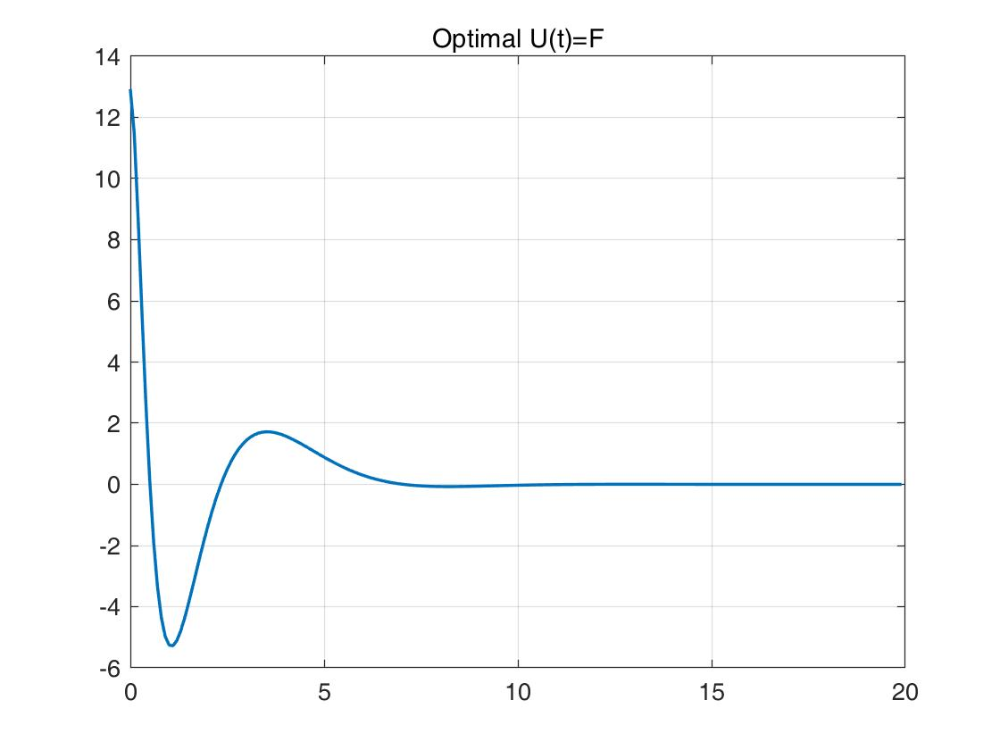

## 一阶倒立摆最优控制 Invert pendulum Optimal Control

考虑一阶倒立摆简化模型如下图，如图所示为非线性不稳定的倒立摆，目标是通过传感器测量𝜃(𝑡)构成反馈控制器来产生输入力𝑓(𝑡)，以保持倒立摆角度𝜃(𝑡) = 0。小车的质量为𝑚1，倒立摆质点质量为𝑚2，假设倒立摆杆没有质量，同时地面光滑。



### 推导过程

##### 系统状态方程求解 using Euler-Lagrange Equation 

详细请见`Doc.pdf`


设状态变量$x=[P,\dot{P},\theta,\dot{\theta}]$，由推导可得：




##### 设计状态反馈

此为LQR问题，Cost Function为：




利用MATLAB中的`dlqr`函数将此系统作为离散系统求解，代码关键部分如下：

```matlab
%% State-Space Model
A1 = [0,1,0,0;
    0,0,-m*g/M,0;
    0,0,0,1;
    0,0,(M+m)*g/M*L,0];

B1 = [0;1/M;0;-1/M*L];

C = [0 0 1 0;
    1,0,0,0];

%% Cost-Fnc wight matrix init
Q = [100,0,0,0;
    0,0,0,0;
    0,0,10,0;
    0,0,0,0];
R = 1;

%% Generate sys
S1 = ss(A1,B1,C,0); % define the sys
Ts = 0.1; % sample time

Sd = c2d(S1,Ts); % transfer to disperse sys
[Ad,Bd,Cd,Dd,TS] = ssdata(Sd); % get disperse-sys state-space matrix

%% LQR
[K,S,e] = dlqr(Ad,Bd,Q,R);

%% Generate new sys with state-feedback
tS = ss(Ad-Bd*K,Bd,Cd,Dd,Ts); % get new sys with state-feedback

%% Given initial state & Plot the result
x0 = [0,0.1,0.05,0]'; % init state: P'=0.1;theta=0.05
t=[0:0.1:20]; % timespan
[Y,X] = initial(tS,x0,t); % calculates the response of sys
```


##### Output

最优状态轨线：



最优控制：



由上图可知，求得了使P=0,θ=0​的最优控制.